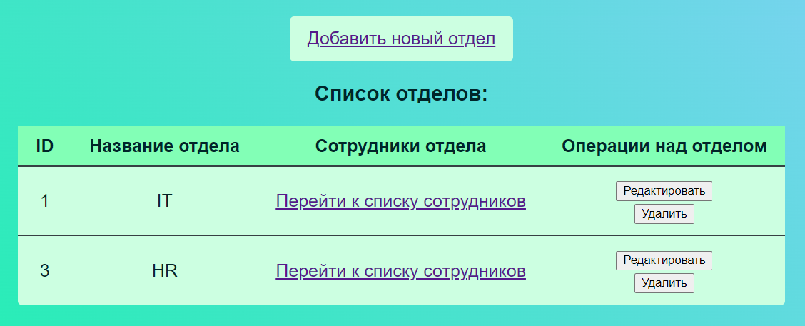
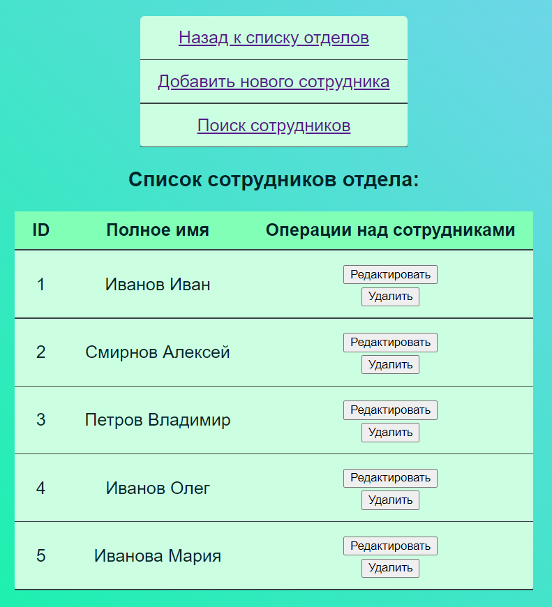

# Organization Management System
Spring Application based on **MVC architectural pattern**.

## Technologies :bulb:
- **Java 8**
- **Maven**
- **Spring Framework** (without Spring Boot)
- **Hibernate**
- **PostgreSQL**
- **Apache Tomcat**
- **Thymeleaf**
- **HTML & CSS**

## Deployment :rocket:
1) Clone this repository `git clone https://github.com/podchez/organization-mvc.git`
2) From the root folder of the project type in the terminal `./mvnw clean package` (building actual .war file)
3) Deploy the packaged application (.war file) using a web server / servlet container (for example, Apache Tomcat)

(the application should start locally on port 8080)

## Screenshots 📷

